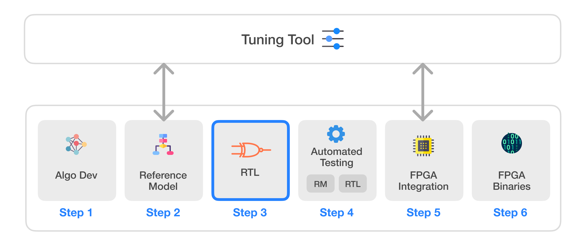
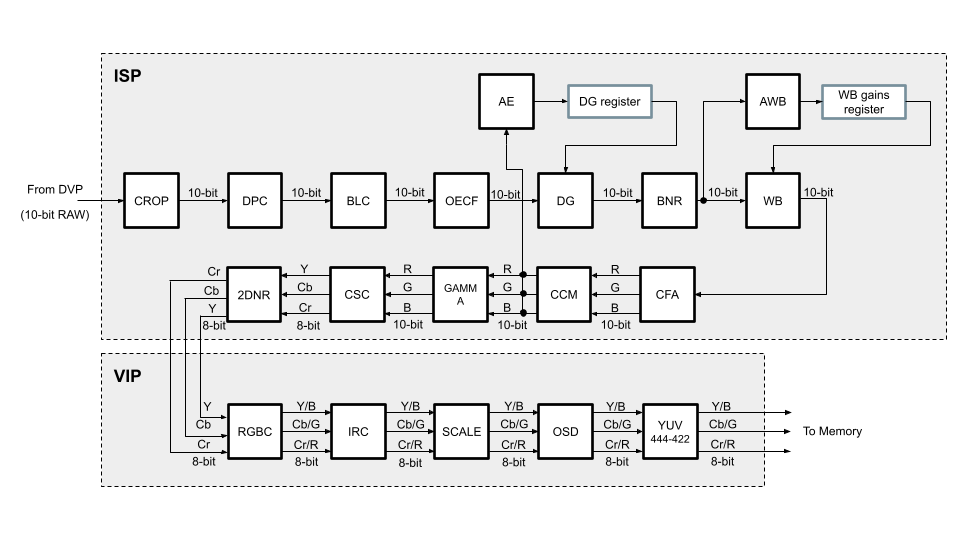

# Infinite-ISP
Infinite-ISP is a full-stack ISP development platform - from algorithm development to RTL design, FPGA/ASIC implementation, and associated firmware, tools, etc. It offers a unified platform that empowers ISP developers to accelerate ISP innovation. It includes a complete collection of camera pipeline modules written in Python, a quantized and optimized Reference Model for RTL development, an FPGA bitstream & the associated Firmware for the implementation of the pipeline on the Kria KV260 development board, and lastly, a stand-alone Python-based Tuning Tool application for the pipeline. The main components of the Infinite-ISP project are listed below:

| Sr.     | Repository name        | Description      | 
|---------| -------------  | ------------- |
| 1  | **[Infinite-ISP_AlgorithmDesign](https://github.com/10x-Engineers/Infinite-ISP)**                     | Python based model of the Infinite-ISP pipeline for algorithm development |
| 2  | **[Infinite-ISP_ReferenceModel](https://github.com/10x-Engineers/Infinite-ISP_ReferenceModel)**                      | Python based fixed-point model of the Infinite-ISP pipeline for hardware implementation |
| 3  | **[Infinite-ISP_RTL](Repo_link)** :anchor: | RTL development of the Infinite-ISP pipeline |
| 4  | **[InfiniteISP_Automated_Testing](Repo_link)** | Streamline the testing and debugging process of RTL developement using RM |
| 5  | **[InfiniteISP_FPGA_XCK26](Repo_link)** | FPGA integration for the Xilinx® Kria KV260’s XCK26 Zynq UltraScale + MPSoC |
| 6  | **[Infinite-ISP_FPGABinaries](https://github.com/10x-Engineers/Infinite-ISP_FPGABinaries)**         | FPGA binaries (bitstream + firmware executable) for the Xilinx® Kria KV260’s XCK26 Zynq UltraScale + MPSoC|
| 7  | **[Infinite-ISP_TuningTool](https://github.com/10x-Engineers/Infinite-ISP_TuningTool)**                              | Collection of calibration and analysis tools for the Infinite-ISP |

# Infinite-ISP RTL

Infinite-ISP RTL is an RTL development project that uses Xilinx Vivado 2022.1 as the development environment. The repo uses **[Infinite-ISP_ReferenceModel](https://github.com/10x-Engineers/Infinite-ISP_ReferenceModel)** (RM) as the baseline to match its outputs. Each block in the RM has a corresponding verilog module in the RTL repo. Modules have been categorized into two groups namely ISP and VIP for the ease of reusability in the FPGA integration process.    

ISP RTL pipeline for `Infinite-ISP_RTL v1.0`

## Objectives
Many open-source ISPs are available over the internet. Most of them are developed by individual contributors, each having its strengths. In addition, they are generally software based and dont't have RTL support. This project aims to centralize all the open-source ISP development to a single place enabling all the ISP developers to have a single platform to contribute both in algorithm development as well the subsequent steps for getting it ready for FPGAs and ASICs. InfiniteISP will not only contain the conventional algorithms but aims to contain state-of-the-art deep learning algorithms as well, enabling a clean comparison between the two. This project has no bounds to ideas and is aimed to include any algorithm that improves the overall results of the pipeline regardless of their complexity.

## How to Get Access
To access Infinite-ISP_RTL, please complete the subscription form on **[Link](https://docs.google.com/forms/d/e/1FAIpQLSfOIldU_Gx5h1yQEHjGbazcUu0tUbZBe0h9IrGcGljC5b4I-g/viewform?usp=sharing)**. Access to the repository will be granted by 10xEngineers within one business day. You will receive an email notification confirming your subscription status. 