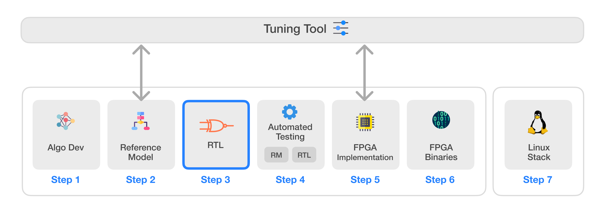

# Infinite-ISP
Infinite-ISP is a full-stack ISP development platform - from algorithm development to RTL design, FPGA/ASIC implementation, and associated firmware, tools, etc. It offers a unified platform that empowers ISP developers to accelerate ISP innovation. It includes a complete collection of camera pipeline modules written in Python, a quantized and optimized Reference Model for RTL development, an FPGA bitstream & the associated Firmware for the implementation of the pipeline on the Kria KV260 development board, and lastly, a stand-alone Python-based Tuning Tool application for the pipeline. The main components of the Infinite-ISP project are listed below:

| Sr.     | Repository name        | Description      | 
|---------| -------------  | ------------- |
| 1  | **[Infinite-ISP_AlgorithmDesign](https://github.com/10x-Engineers/Infinite-ISP)**   | Python based model of the Infinite-ISP pipeline for algorithm development |
| 2  | **[Infinite-ISP_ReferenceModel](https://github.com/10x-Engineers/Infinite-ISP_ReferenceModel)**                      | Python based fixed-point model of the Infinite-ISP pipeline for hardware implementation |
| 3  | **[Infinite-ISP_RTL](https://github.com/10x-Engineers/Infinite-ISP_RTL)** :anchor: | RTL development of the Infinite-ISP pipeline **[(Request Access)](https://docs.google.com/forms/d/e/1FAIpQLSfOIldU_Gx5h1yQEHjGbazcUu0tUbZBe0h9IrGcGljC5b4I-g/viewform?usp=sharing)** |
| 4  | **[Infinite-ISP_Automated_Testing](https://github.com/10x-Engineers/Infinite-ISP_Automated_Testing)** | Streamline the testing and debugging process of RTL developement using [Infinite-ISP_ReferenceModel](https://github.com/10x-Engineers/Infinite-ISP_ReferenceModel) |
| 5  | **FPGA Implementation** | FPGA integration of Infinite-ISP on different FPGAs    <ul><li>Xilinx® Kria KV260’s XCK26 Zynq UltraScale + MPSoC **[Infinite-ISP_FPGA_XCK26](https://github.com/10x-Engineers/Infinite-ISP_FPGA_XCK26)**</li></ul>   |
| 6  | **[Infinite-ISP_FPGABinaries](https://github.com/10x-Engineers/Infinite-ISP_FPGABinaries)**         | FPGA binaries (bitstream + firmware executable) for the Xilinx® Kria KV260’s XCK26 Zynq UltraScale + MPSoC|
| 7  | **[Infinite-ISP_TuningTool](https://github.com/10x-Engineers/Infinite-ISP_TuningTool)**                              | Collection of calibration and analysis tools for the Infinite-ISP |

# Infinite-ISP RTL

Infinite-ISP_RTL is a project that encapsulates the development of RTL for the infinite-ISP (Image Signal Processor ). The repository uses [Infinite-ISP_ReferenceModel](https://github.com/10x-Engineers/Infinite-ISP_ReferenceModel) (RM) as the reference and ensures a bit accurate translation of the reference model. This workflow facilitates the integration of expertise in both hardware design and algorithm development. Each block in the RM is mapped to a corresponding Verilog module within the RTL repository. For FPGA integration and enhanced reusability, these modules are categorized into two groups: ISP and VIP.    

ISP RTL pipeline for `Infinite-ISP_RTL v1.0`

## Objectives
Many open-source ISPs are available over the internet. Most of them are developed by individual contributors, each having its strengths. In addition, they are generally software-based and don't have RTL support. This project aims to centralize all the open-source ISP development to a single place enabling the ISP developers to have a single platform to contribute both in algorithm development and the subsequent steps for preparing it for FPGAs and ASICs.

## How to Get Access
To access Infinite-ISP_RTL, please fill in a request form at **[Link](https://docs.google.com/forms/d/e/1FAIpQLSfOIldU_Gx5h1yQEHjGbazcUu0tUbZBe0h9IrGcGljC5b4I-g/viewform?usp=sharing)**. Access to the repository will be granted by 10xEngineers within one business day. You will receive an email notification confirming your access status.

## Resource Utilization

   Below are the resource utilization tables compiled for Xilinx® Kria KV260 Development Board using Xilinx® Vivado IDE v2022.1.

    
   **Resource utilization for ISP (2048x1536 resolution):**
   
   | Block Name &nbsp;&nbsp;&nbsp;&nbsp;&nbsp;&nbsp;&nbsp;&nbsp;&nbsp;&nbsp;&nbsp;&nbsp;&nbsp;&nbsp;&nbsp;&nbsp;&nbsp;&nbsp;&nbsp;&nbsp;&nbsp;&nbsp;&nbsp;&nbsp;&nbsp;&nbsp;&nbsp;&nbsp;&nbsp;                          | LUT     | FF     | BRAM  | DSP   |
   | ------------------- | :---------: | :---------: | :---------: | :---------: |
   | Crop                |  159    | 144    | 0     | 0     |
   | DPC                 |  652    | 642    | 4     | 0     |
   | BLC                 |  117    | 120    | 0     | 4     |
   | OECF                |  37     | 62     | 2     | 0     |
   | DG                  |  250    | 17     | 0     | 1     |
   | BNR                 |  10087  | 6567   | 20    | 25    |
   | WB                  |  33     | 44     | 0     | 1     |
   | Demosaic            |  739    | 628    | 4     | 0     |
   | AE                  |  2308   | 2242   | 0     | 5     |
   | AWB                 |  803    | 922    | 1     | 0     |
   | CCM                 |  136    | 263    | 0     | 9     |
   | GC                  |  31     | 67     | 1.5   | 0     |
   | CSC                 |  281    | 387    | 0     | 13    |
   | 2DNR                |  23210  | 4403   | 8     | 0     |
   | isp_top             |  38771  | 16694  | 40.5  | 58    |
   
   **Resource utilization for VIP (2048x1536 resolution):**
   
   | Block Name &nbsp;&nbsp;&nbsp;&nbsp;&nbsp;&nbsp;&nbsp;&nbsp;&nbsp;&nbsp;&nbsp;&nbsp;&nbsp;&nbsp;&nbsp;&nbsp;&nbsp;&nbsp;&nbsp;&nbsp;&nbsp;&nbsp;&nbsp;&nbsp;&nbsp;&nbsp;&nbsp;&nbsp;&nbsp;                          | LUT     | FF     | BRAM  | DSP   |
   | ------------------- | :---------: | :---------: | :---------: | :---------: |
   | RGBC                | 388     | 231    | 0     | 0     |
   | IRC                 | 124     | 42     | 0     | 0     |
   | Scale               | 381     | 184    | 0     | 0     |
   | OSD                 | 1021    | 532    | 1     | 0     |
   | YUV Conv            | 31      | 54     | 0     | 0     |
   | vip_top             | 1983    | 1251   | 1     | 0     |

   **Resource utilization for ISP-Pipeline (2048x1536 resolution):**
   
   | Block Name &nbsp;&nbsp;&nbsp;&nbsp;&nbsp;&nbsp;&nbsp;&nbsp;&nbsp;&nbsp;&nbsp;&nbsp;&nbsp;&nbsp;&nbsp;&nbsp;&nbsp;&nbsp;&nbsp;&nbsp;&nbsp;&nbsp;&nbsp;&nbsp;&nbsp;&nbsp;&nbsp;&nbsp;&nbsp;                          | LUT     | FF     | BRAM  | DSP   |
   | ------------------- | :---------: | :---------: | :---------: | :---------: |
   | isp_top + vip_top   | 40754   | 17945  | 41.5  | 58    |

## License 
This project is licensed under Apache 2.0 (see [LICENSE](LICENSE) file).

## Acknowledgments
- The Infinite-ISP_RTL project started of from the inspiration of [bxinquan/zynqmp_cam_isp_demo](https://github.com/bxinquan/zynqmp_cam_isp_demo.git)
